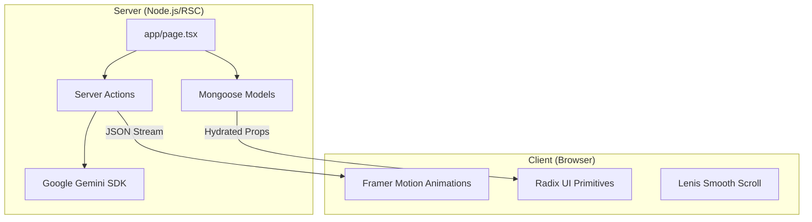
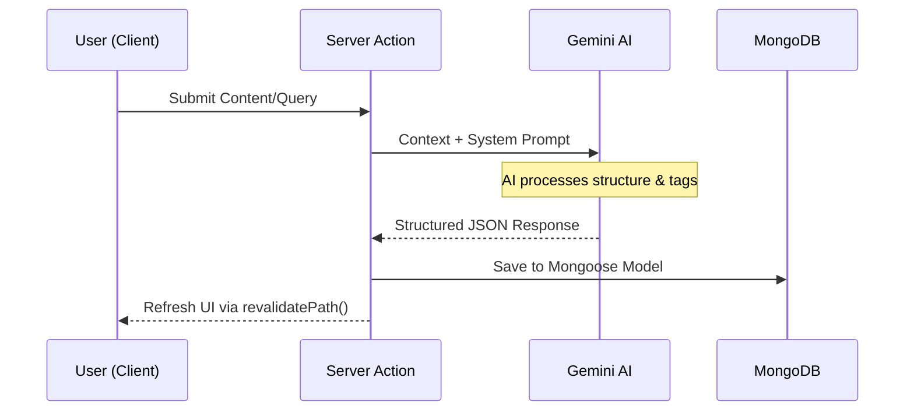

# Chameleon Docs 🦎

> **Documentation, Reimagined.**  
> A flexible, open-source documentation platform that adapts to your team’s workflow. Clean, fast, and beautiful by default.


---

## ✨ Why Chameleon Docs?

Chameleon Docs is built to make documentation feel alive — not static.  
It’s designed for teams who want clarity, flexibility, and an open space for collaboration.

### Key Goals
- 📚 Simple, readable documentation structure  
- 🧩 Easy to customize and extend  
- 🤝 Beginner-friendly open-source project  
- 🚀 Lightweight and framework-agnostic

---


---

## ✨ Overview

**Chameleon Docs** is a next-generation documentation platform leveraging **Next.js React Server Components (RSC)** and **Google Gemini AI**. It moves away from static, boring wikis to create a dynamic environment where the interface "morphs" based on content context and user intent.

Built for **ECWOC'26**, it prioritizes zero-latency performance while delivering a premium user experience through glassmorphism and micro-interactions.

---

## 🚀 Key Features

- **⚡ Zero Latency:** Powered by Next.js App Router and React Server Components for instant page transitions and optimal performance.
- **🎨 Visual Bliss:** A strict, atomic design system featuring glassmorphism, smooth gradients, and micro-interactions.
- **🧠 AI-Powered:** Integrated with **PuterJS** (using `google/gemini-3-flash-preview` model) for intelligent content reimagination - no API keys required!
- **🦎 Adaptive Interface:** A "Chameleon" theme that adapts to user preferences, featuring a command menu (`cmdk`) for keyboard-first navigation.
- **🔐 Secure Authentication:** Robust auth system using **NextAuth.js** and **MongoDB**.
- **🌊 Smooth Experience:** Enhanced scrolling with **Lenis** and fluid animations with **Framer Motion**.

---

## 🛠️ Tech Stack

- **Framework:** [Next.js](https://nextjs.org/)
- **Language:** [TypeScript](https://www.typescriptlang.org/)
- **Styling:** [Tailwind CSS](https://tailwindcss.com/), `tailwind-merge`, `cva`
- **Animations:** [Framer Motion](https://www.framer.com/motion/), [Lenis](https://lenis.studio/)
- **Database:** [MongoDB](https://www.mongodb.com/) (via Mongoose)
- **Authentication:** [NextAuth.js](https://authjs.dev/)
- **AI:** [PuterJS](https://puter.com/) (client-side, uses `google/gemini-3-flash-preview`)
- **UI Components:** [Radix UI](https://www.radix-ui.com/), [Lucide React](https://lucide.dev/)
- **Markdown:** `react-markdown`, `remark-gfm`, `react-syntax-highlighter`

---

## 🧠 Architecture
To empower our contributors, we’ve visualized the internal "magic" that keeps the platform performant while handling complex AI logic.

### 1. RSC vs. Client Boundary
We use a **"Server-First"** approach. Data fetching and AI orchestration happen on the server to keep the client-side bundle lean and fast.


### 2. Adaptive AI Content Flow
This flow shows how the Google Generative AI SDK integrates with Next.js Server Actions to process and organize documentation:


---

## 🏁 Getting Started

### Prerequisites

- Node.js 18+
- MongoDB Database (Local or Atlas)

### Installation

1.  **Clone the repository:**

    ```bash
    git clone https://github.com/AtharvRG/chameleon-docs.git
    cd chameleon-docs
    ```

2.  **Install dependencies:**

    ```bash
    npm install
    ```
#### 3.  **Set up environment variables:**
    Create a `.env.local` file in the root directory and add the following:

    ```env
    # Database
    MONGODB_URI=your_mongodb_connection_string
    # Authentication
    AUTH_SECRET=your_nextauth_secret

    # App
    NEXT_PUBLIC_APP_URL=http://localhost:3000
    ```

    > **Note:** No API key is needed for AI features! PuterJS handles AI through its client-side SDK with automatic temporary user creation.

4.  **Run the development server:**

    ```bash
    npm run dev
    ```
#### 5.  Open [http://localhost:3000](http://localhost:3000) in your browser.

---

## 📂 Project Structure

```bash
chameleon-docs/
├── actions/        # Server actions for data mutation
├── app/            # Next.js App Router pages and layouts
├── components/     # Reusable UI components
│   ├── ui/         # Primitive components (buttons, inputs, etc.)
│   └── ...         # Feature-specific components
├── hooks/          # Custom React hooks
├── lib/            # Utility functions and configurations
├── models/         # Mongoose database models
├── public/         # Static assets
└── types/          # TypeScript type definitions
```

---

## 🤝 Contributing
Contributions are welcome! Please feel free to submit a Pull Request.

1.  Fork the project
2.  Create your feature branch (`git checkout -b feature/AmazingFeature`)
3.  Commit your changes (`git commit -m 'Add some AmazingFeature'`)
4.  Push to the branch (`git push origin feature/AmazingFeature`)
5.  Open a Pull Request

---

## 📄 License

This project is licensed under the MIT License - see the LICENSE file for details.

---

<div align="center">
  <p>Made with ❤️ by Anchor</p>
</div>
